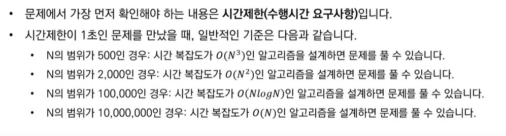
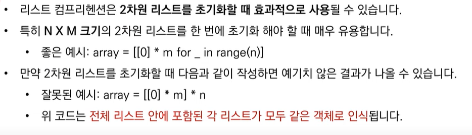
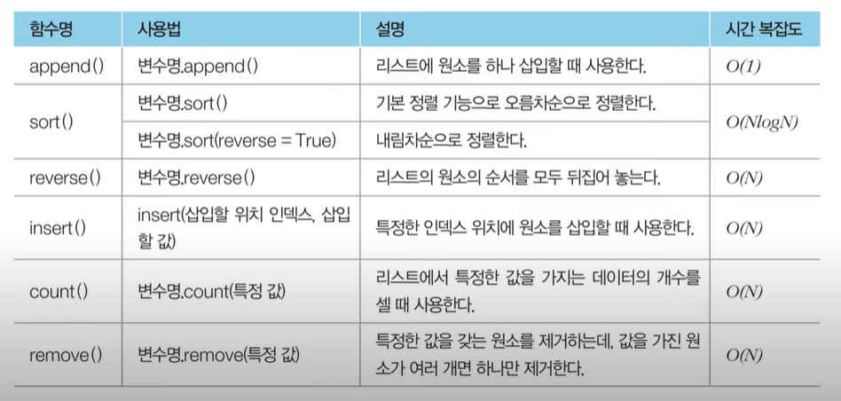

# Algorithm
## 2021~
### 시간복잡도

O(logn) - 1000(2^10) -> 10

출처: https://www.youtube.com/watch?v=m-9pAwq1o3w&list=PLRx0vPvlEmdAghTr5mXQxGpHjWqSz0dgC

### 리스트

출처: https://www.youtube.com/watch?v=m-9pAwq1o3w&list=PLRx0vPvlEmdAghTr5mXQxGpHjWqSz0dgC
